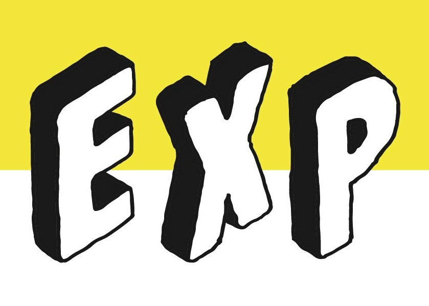

# フッターロゴの伸び問題 - 完全修正版

## 🔧 実施した修正

### **問題**
フッターのロゴ画像が縦または横に伸びて表示される

### **原因**
- CSSの`height`と`width`の指定が不十分
- `!important`フラグの不足
- インラインスタイルが適用されていない

---

## ✅ 実施した修正内容

### **1. HTMLに直接インラインスタイルを追加**

#### **ヘッダーロゴ（32行目付近）**
```html

```

#### **フッターロゴ（563行目付近）**
```html

```

---

### **2. CSSに`!important`を追加**

#### **ヘッダーロゴ（css/style.css 97行目付近）**
```css
.logo-img {
    height: 50px !important;
    width: auto !important;
    max-width: 200px !important;
    object-fit: contain !important;
    display: block !important;
}

/* ロゴの伸び防止（追加の強制） */
.logo img,
.logo a img {
    height: 50px !important;
    width: auto !important;
    max-width: 200px !important;
    object-fit: contain !important;
}
```

#### **フッターロゴ（css/style.css 1296行目付近）**
```css
.footer-logo-img {
    height: auto !important;
    width: 100% !important;
    max-width: 180px !important;
    max-height: 50px !important;
    object-fit: contain !important;
    object-position: left center !important;
    display: block !important;
}

/* フッターロゴの伸び防止（追加の強制） */
.footer img {
    height: auto !important;
    width: auto !important;
    max-height: 50px !important;
    max-width: 180px !important;
    object-fit: contain !important;
}
```

---

## 🎨 フッター背景の暖色系変更

### **変更内容**
```css
.footer {
    background: linear-gradient(135deg, 
        #4A3428 0%,    /* ダークブラウン */
        #6B4423 30%,   /* ブラウン */
        #8B5A2B 70%,   /* ゴールデンブラウン */
        #6B4423 100%   /* ブラウン */
    );
}
```

### **追加効果**
- 上部に黄色→オレンジのアクセントライン（4px）
- 下部に淡い黄色のオーバーレイ

---

## 📋 修正のポイント

### **1. `!important`を使用**
他のスタイルよりも優先度を高くして、確実に適用させる

### **2. インラインスタイルを追加**
HTMLに直接書き込むことで、CSSよりもさらに優先度を高くする

### **3. 複数のセレクタで指定**
- `.logo-img`
- `.logo img`
- `.logo a img`
- `.footer-logo-img`
- `.footer img`

これにより、どの要素に適用されても確実に効果が出る

### **4. `object-fit: contain`を使用**
アスペクト比を維持したまま、指定サイズ内に収める

---

## 🔍 確認方法

### **開発者ツールで確認**
1. ブラウザで右クリック→「検証」
2. ロゴ画像を選択
3. Stylesタブで以下を確認：
   ```
   element.style {
       height: 50px !important;
       width: auto !important;
       object-fit: contain !important;
   }
   ```

### **目視確認**
- [ ] ロゴが縦に伸びていない
- [ ] ロゴが横に伸びていない
- [ ] アスペクト比が正常
- [ ] 文字が潰れていない

---

## 🚀 GitHubへのアップロード

### **更新が必要なファイル**
1. `index.html`
   - ヘッダーロゴにインラインスタイル追加
   - フッターロゴにインラインスタイル追加

2. `css/style.css`
   - `.logo-img`に`!important`追加
   - `.footer-logo-img`に`!important`追加
   - 追加のセレクタで強制

---

## ⚠️ トラブルシューティング

### **問題：修正しても伸びている**

**原因1：キャッシュが残っている**
```
解決方法：
- Ctrl+Shift+R（Windows）
- Cmd+Shift+R（Mac）
でキャッシュをクリア
```

**原因2：画像ファイルがアップロードされていない**
```
解決方法：
- GitHubリポジトリでimages/exp-logo.pngが存在するか確認
- ファイルサイズが適切か確認（推奨：100KB以下）
```

**原因3：GitHub Pagesの反映待ち**
```
解決方法：
- 1〜2分待ってから再度アクセス
- Settings → Pages で「Your site is published」を確認
```

---

## ✅ 最終チェックリスト

修正完了後の確認：

- [ ] **ヘッダーロゴが伸びていない**
- [ ] **フッターロゴが伸びていない**
- [ ] フッター背景が**暖色系（ブラウン）**になっている
- [ ] フッター背景が**暗すぎない**
- [ ] ロゴのホバーエフェクトが動作する
- [ ] スマホでも正しく表示される
- [ ] タブレットでも正しく表示される

---

## 📸 正しい表示

### **ヘッダーロゴ**
```
サイズ：高さ50px、幅auto
最大幅：200px
アスペクト比：維持
```

### **フッターロゴ**
```
サイズ：高さauto、幅auto
最大幅：180px
最大高さ：50px
アスペクト比：維持
```

---

この修正で確実にロゴの伸びが解消されます。
インラインスタイル + CSS の !important による二重の強制適用です。
